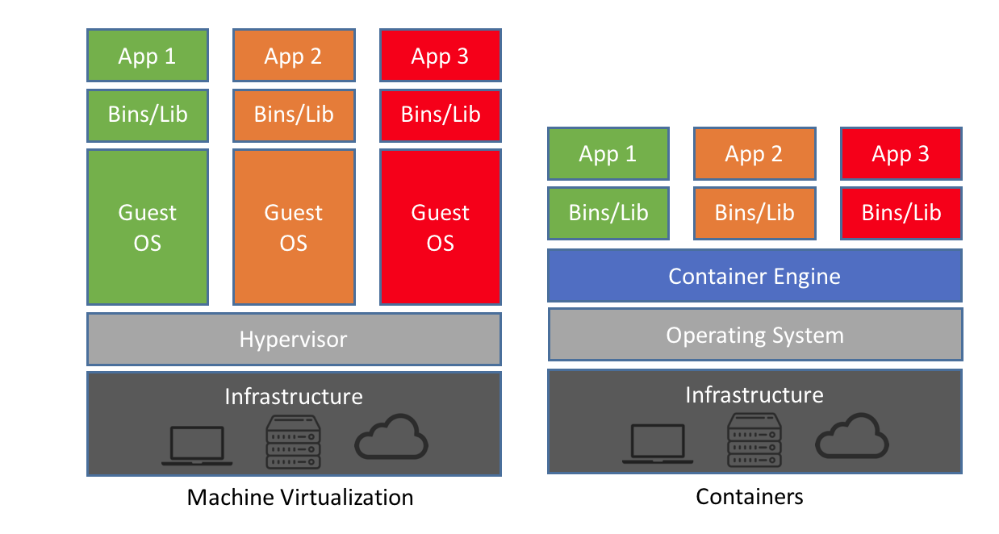
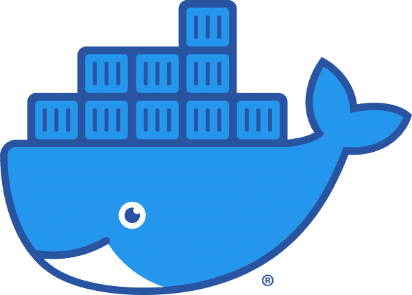

# 1. Getting Started with Containers

!!! circle-question "Overview"
    
    **Questions**
    - What is a container and why might I want to use it?

    **Objectives**
    Understand what a container is and when you might want to use it.

## What are Containers

A container is an entity providing an isolated software environment (or filesystem) for an application and its dependencies.

If you have already used a Virtual Machine, or VM, you’re actually already familiar with some of the concepts of a container.

The key difference here is that VMs virtualise hardware while containers virtualise operating systems. There are other differences (and benefits), in particular containers are:

- lighter weight to run (less CPU and memory usage, faster start-up times)
- smaller in size (thus easier to transfer and share)
- modular (possible to combine multiple containers that work together)

Since containers do not virtualise the hardware, containers must be built using the same architecture as the machine they are going to be deployed on. Containers built for one architecture cannot run on the other.

## Containers and your workflow
There are a number of reasons for using containers in your daily work:

!!! quote "" 

    - Data reproducibility/provenance
    - Cross-system portability
    - Simplified collaboration
    - Simplified software dependencies and management
    - Consistent testing environment

## Terminology
We’ll start with a brief note on the terminology used in this section of the course. We refer to both images and containers. What is the distinction between these two terms?

!!! clipboard-question "" 

    **Images** are bundles of files including an operating system, software and potentially data and other application-related files. They may sometimes be referred to as a disk image or container image and they may be stored in different ways, perhaps as a single file, or as a group of files. Either way, we refer to this file, or collection of files, as an image.
    
    A **container** is a virtual environment that is based on an image. That is, the files, applications, tools, etc that are available within a running container are determined by the image that the container is started from. It may be possible to start multiple container instances from an image. You could, perhaps, consider an image to be a form of template from whi***ch running container instances can be started.
    
    A **registry** is a server application where images are stored and can be accessed by users. It can be public (e.g. Docker Hub) or private.
    
    To build an image we need a recipe. A recipe file is called a **Definition File**, or **def file**, in the Apptainer jargon and a **Dockerfile** in the Docker world.

### Container engines
A number of tools are available to create, deploy and run containerised applications. Some of these will be covered throughout this tutorial:

-   
{width="100"}

    __Docker__

    The first engine to gain popularity, still widely used in the IT industry. Not very suitable for HPC as it requires root privileges to run.

-   
{width="100"}

    
    __Singularity__

    A simple, powerful root-less container engine for the HPC world. Originally developed at the Lawrence Berkeley National Laboratory.

    **SingularityCE** is a community driven fork of the original **Singularity** project, 

-   
{width="100"}

    __Apptainer__

    A simple, powerful root-less container engine for the HPC world. Originally developed at the Lawrence Berkeley National Laboratory. Successor of Singularity with renaming in 2021.

